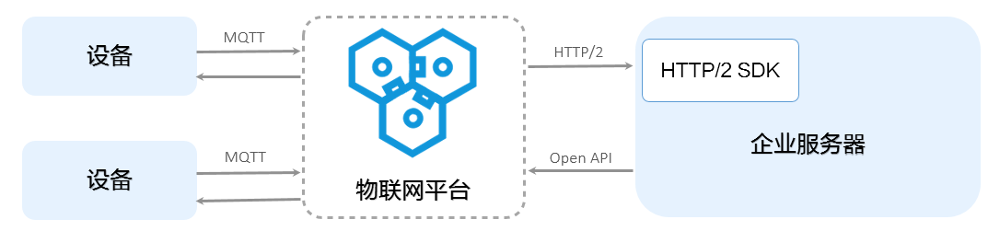

## 阿里云iot--HTTP-2服务端订阅
## 官网地址
阿里云iot-服务端订阅：https://help.aliyun.com/document_detail/89226.html?spm=a2c4g.11186623.6.579.6fc8522fu88tyn

## HTTP-2服务端订阅调研
- 阿里云iot服务端订阅资料
- 什么是HTTP/2
- HTTP/2与HTTP/1.0,HTTP/1.1,SPDY的对比
- 什么是HTTP/2服务端订阅
- HTTP-2服务端订阅初步实现(程序设计)
- 对照瀚云平台实现HTTP-2服务端订阅(程序设计)

#### 阿里云iot服务端订阅资料
###### 什么是服务端订阅
1. 服务端可以直接订阅产品下所有类型的消息：设备上报消息、设备状态变化通知、网关发现子设备上报消息、设备生命周期变更消息和设备拓扑关系变更消息。
2. 配置服务端订阅后，物联网平台会将产品下所有设备的已订阅类型的消息转发至您的服务端。
3. 目前支持两种订阅方式：通过HTTP/2通道进行消息流转和推送消息到消息服务（MNS）。

###### 使用场景
服务端订阅适用于单纯的接收设备数据的场景，并且适用于高并发场景。如果您有多个服务器，服务端订阅的消息会随机转发至某个服务器。

还需同时满足以下条件的场景：

- 服务端接收产品下全部设备的订阅数据。
- 设备数据流转性能要求不超过5000条/秒。

###### HTTP/2服务端订阅
新版物联网平台通过HTTP/2通道进行消息流转。您配置HTTP/2服务端订阅后，物联网平台会将产品下所有设备的已订阅类型消息，通过HTTP/2通道推送至服务端。  
HTTP/2通道服务端订阅消息流转流程图如下：

